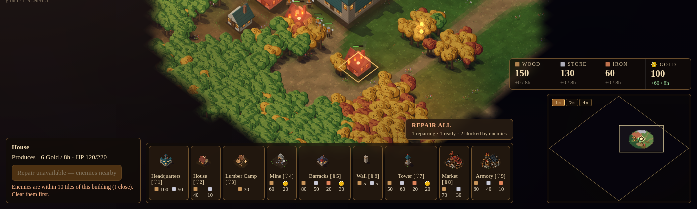

# Building repair + Repair All

| Field | Value |
|---|---|
| Feature ID | `BUILDING-REPAIR-1.1.0` |
| Workstream | `economy-production` |
| Issue / Project | [#4](https://github.com/CrazyShot/features-library/issues/4) · status is tracked in the [Project](https://github.com/users/CrazyShot/projects/1) |
| Target game revision | Prototype "Emberfall — RTS Map Prototype" (single-file index.html) as supplied 2026-10-08; main-repo commit: **to be filled in by the integrator** |
| Depends on | soft: `CTRLGROUPS-2.0.0` (multi-building selection) |

## What it does
- **Repair / Stop repair** button in the building panel for damaged, completed buildings. Uses the existing `b.hp / b.mh` (no new health system) and the existing `COST` table / `G.res`; driven by the game's own `stepSim(dt)` (pause and speed apply).
- **Rate/cost (config):** `repairSeconds = 40` (mh/40 HP per game-second); `costFraction = 0.4` (a full repair from 0 HP costs 40% of the build cost, scaled by HP restored, paid in whole units as it accrues; if a resource runs out the repair stops).
- **Enemy proximity:** repair is blocked **per building** while any enemy is within `threatRadius = 10` tiles of that building's centre; an active repair **pauses** (no healing, no charge) and resumes after 1 s clear. Panel button + note + toast explain it.
- **Repair All:** floating button above the build bar with live counts ("1 repairing · 2 ready · 1 blocked by enemies"). Starts the normal repair on every damaged, completed, enemy-free building; skips full-HP, under-construction, destroyed and threatened ones; each started building reserves 1 unit of each resource it needs so a shared shortage is detected up front. Nothing heals instantly.
- Not allowed: destroyed, full-HP, under-construction buildings. Stops cleanly on full HP, destruction, removal from `B` (e.g. a future sell), game over, or resource shortage.

## Files
`src/FEATURE_BUILDING-REPAIR.html` · `tests/` · `docs/`

## Limitations
- **No sell/demolish exists in the game**; "sold" is handled generically (a building that leaves `B` stops repairing). Not tested against a real sell.
- Every enemy counts (wave and wilderness), by real position, regardless of fog: a sleeping wild group within 10 tiles blocks repair. `threatRadius` is a config value.
- A real wave starting mid-repair will legitimately pause repairs near buildings its enemies reach.
