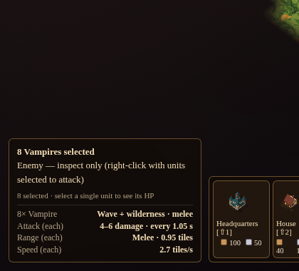

# Unit / enemy information panel

| Field | Value |
|---|---|
| Feature ID | `UNIT-INFO-PANEL-1.1.0` |
| Workstream | `rts-controls-qol` |
| Issue / Project | [#3](https://github.com/CrazyShot/features-library/issues/3) · status is tracked in the [Project](https://github.com/users/CrazyShot/projects/1) |
| Target game revision | Prototype "Emberfall — RTS Map Prototype" (single-file index.html) as supplied 2026-10-08; main-repo commit: **to be filled in by the integrator** |
| Depends on | none |

## What it does
- **One selected unit** (dwarf, ranger or enemy): type/category, **its own HP and HP bar**, attack (damage, cooldown, ≈dps), range (melee/ranged + tiles), move speed, status (idle/moving/fighting; enemy target).
- **Several selected units** (friendly or enemy): a group summary — count, per-type attack/range/speed labelled "each" — and **no combined or averaged HP** (a summed bar hides who is wounded). Mixed wave+wilderness enemies show a damage range.
- **Enemies are inspect-only**: left-click a visible enemy. They live in the feature's own list and **never enter `SU`**, so no command can reach them and combat/AI code is untouched. Right-click attack with units selected is unchanged.
- No armor row: **the game has no armor/defense stat**.

## Files
`src/FEATURE_UNIT-INFO-PANEL.html` · `tests/` · `docs/`

## Limitations
- Three values are literals in the host AI and are **mirrored** in the feature's `STATS` table: ranger damage 9, ranger cooldown 1 s, enemy cooldown 1.05 s. If the AI changes them, edit `STATS` (everything else is read live: `DW.*`, `RANGE`, `REACH`, `SPD`, `ESPD`, `e.dmg`, `hp/mh`).
- Enemies are always called "Vampire" (the enemy objects carry no name).
