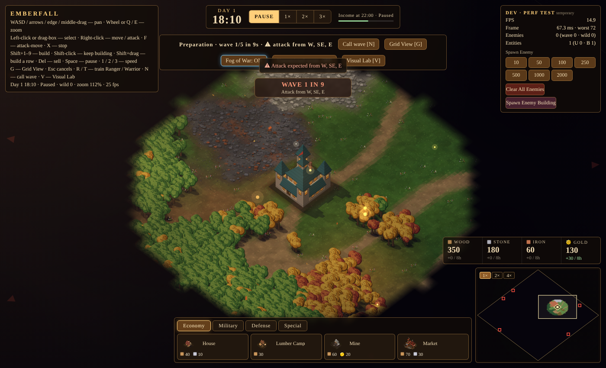
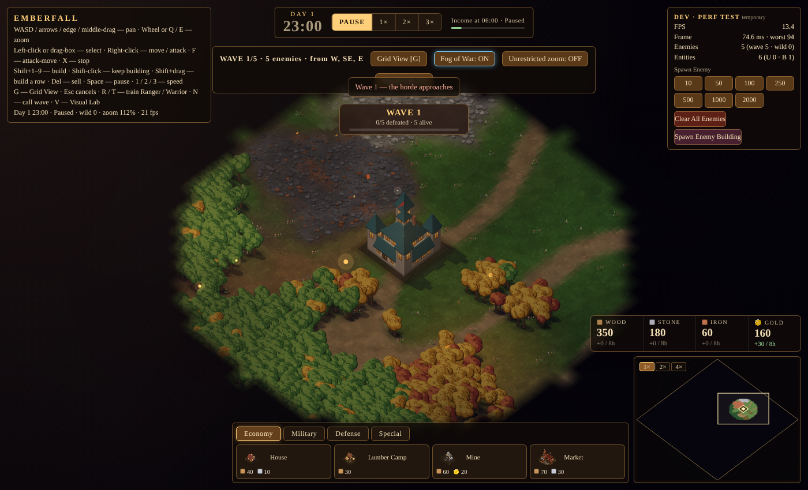

# Wave Director

| Field | Value |
|---|---|
| Feature ID | `WAVE-DIRECTOR-1.0.0` |
| Workstream | `waves-survival` |
| Issue / Project | [#9](https://github.com/CrazyShot/features-library/issues/9) · status is tracked in the [Project](https://github.com/users/CrazyShot/projects/1) (not here) |
| Target game revision | "Emberfall" single-file prototype supplied 2026-10-10 (`index (2).html`, sha256 `119f565650b7c0f7…`); main-repo commit: **to be filled in by the integrator** |
| Depends on | none |
| Supersedes | none |

## What it does
The Survival attack loop: **preparation → warning → countdown → wave (scheduled spawns) → completion → recovery → next preparation → … → final wave → signal.**
It is **not a second wave controller**: it wraps the host's `waveTick(dt)` and *replaces its scheduling part*, so there is still exactly one controller. It owns no enemy AI, combat or clock. All timing comes from the sim `dt` the host passes in, so pause, 1×/2×/3× speed and game-over freeze or scale it for free.

- **Warnings + countdowns** — spawn directions are announced `warnLead` (22 s) before the attack through the host's own `planWave()` (toast + map/minimap markers); `countdown` events at 10, 5, 4, 3, 2, 1 s; floating banner ("WAVE 3 IN 7"); the host's `#wv` line shows the same.
- **Preparation + recovery** — 55 s before wave 1, then recovery (10 s, no countdown/markers) + 45 s before each later wave (all configurable).
- **Counts + difficulty** — host curve for waves 1–5 (5, 8, 11, 14, 18), +4 per extra wave, `countMult` knob, optional extra `hpGrowth`; the host's own 12 %/wave hp scaling is kept.
- **Compositions** — the host has one wave enemy, so variants are multipliers on its existing fields (`mh/hp`, `dmg`, `sm`): **grunt** (unmodified), **swift** (hp ×0.6, dmg ×0.8, speed ×1.35, from wave 3), **brute** (hp ×2.4, dmg ×1.6, speed ×0.8, from wave 4). Each enemy is tagged `e.wtype` / `e.wnum` for a future renderer.
- **Spawn scheduling + progress** — every enemy is created by the host's `spawnE(p)` (so `G.wE`, AI and combat are untouched); evenly interleaved types; spacing 0.8 s, compressed so a huge wave still arrives within `maxSpawnSpan`; live progress in `status()`.
- **Completion detection** — the exact enemy objects it spawned are tracked; deaths, quiet removals (age-out, `devClear`) all count; the wave completes when the queue is empty and none are left for `clearDelay`.
- **Pause / resume / cancel** — game pause is free; `pause()/resume()` hold the schedule while the game runs; `cancel({killEnemies})` stops the attack cleanly; `start()` / `jumpTo(n)` restart.
- **Final wave** — `cfg.finalWave` (default = host `WAVES`; `Infinity` = endless). When it is defeated: `finalWaveDefeated` event + window event `bastion:final-wave-defeated` + `status().finalDefeated`, then the host's `endGame(true)` (or nothing with `onFinalDefeated:'signal'`).

 

## Files
- `src/FEATURE_WAVE-DIRECTOR.html` — the feature block (style + script), insert before `</body>`
- `tests/` — headless-browser tests (behaviour, host-contract preflight, integration regression, save/load hazards) + `build_test_game.py` (injects the block into a *temporary* copy of the game); see `tests/README.md`
- `docs/` — screenshots
- `INTEGRATION.md` — hooks, API, ranked fragile points, exact test coverage, what is **not** tested
- `INTEGRATION_CHECKLIST.md` — ordered checklist, mandatory glue, regression commands for the integrator

## Limitations
See `INTEGRATION.md`. Headlines: one host enemy type → variants are stat multipliers only; **Save/Load needs a one-line re-adoption call** (`disable(); enable()`); not integrated into the latest game and **not manually playtested**; balance unvalidated.
